# SIEM Threat Detection Lab

## Project Overview

This project demonstrates a hands-on **SIEM threat detection lab** using **Wazuh**, **Ubuntu**, and a monitored **Windows endpoint**. The lab was built in **Oracle VirtualBox** to simulate a small security monitoring environment where endpoint activity is collected, analyzed, and reviewed through a centralized SIEM dashboard.

I deployed Wazuh on an Ubuntu VM, connected a Windows client using the Wazuh agent, and generated security events to validate detection of suspicious activity. The simulated scenarios included repeated failed login attempts and unauthorized local administrator account creation.

---

## Objectives

- Deploy a functional Wazuh SIEM server on Ubuntu
- Connect a Windows endpoint to the SIEM using the Wazuh agent
- Verify endpoint visibility and log ingestion
- Simulate suspicious authentication and privilege escalation activity
- Review generated alerts in the Wazuh dashboard
- Document the lab in a clear, professional format

---

## Lab Environment

| Component | Purpose |
|---|---|
| Ubuntu VM | Hosts the Wazuh server |
| Windows Client VM | Monitored endpoint running the Wazuh agent |
| Oracle VirtualBox | Virtualization platform |
| Host-Only Network | Allows communication between the Wazuh server and Windows endpoint |
| Wazuh Dashboard | Used to review agents, alerts, and security events |

---

## Key Technologies

- **Wazuh** – SIEM and endpoint security monitoring platform
- **Ubuntu Linux** – Operating system used to host the Wazuh server
- **Windows** – Monitored endpoint used for event generation
- **Oracle VirtualBox** – Virtual lab environment
- **PowerShell** – Used to simulate administrative activity
- **Windows Event Logs** – Source of authentication and security events

---

## Network Topology

The lab uses a two-VM setup:

- **Wazuh Server:** Ubuntu VM running the Wazuh platform
- **Windows Endpoint:** Windows client VM with the Wazuh agent installed
- **Network:** VirtualBox host-only network for communication between the server and endpoint

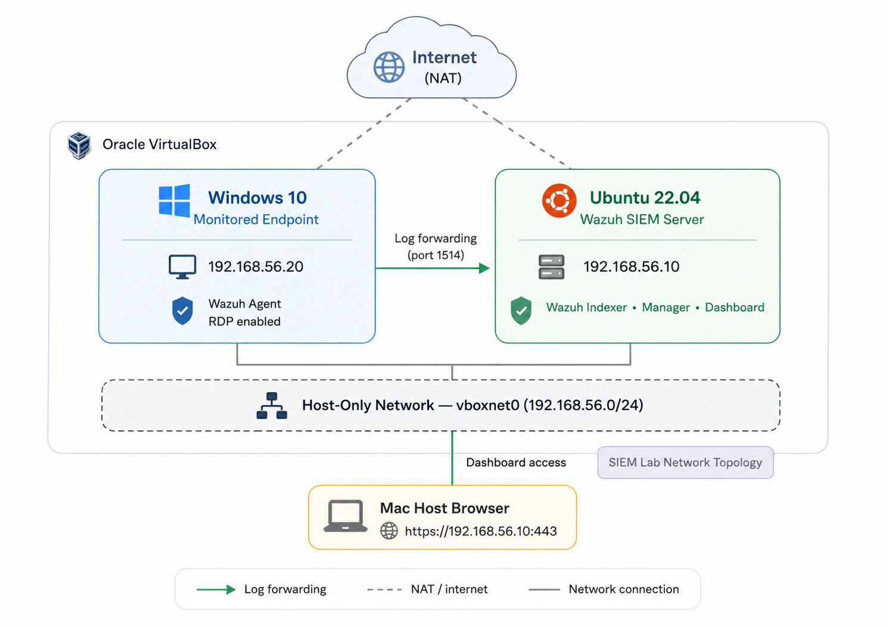

---

## Detection Scenarios

### Scenario 1: Failed Login Activity

Repeated failed login attempts were generated on the Windows endpoint to simulate suspicious authentication behavior. These events were collected by the Wazuh agent and displayed in the Wazuh dashboard.

**Security relevance:**  
Repeated authentication failures can indicate brute-force attempts, password guessing, misconfigured services, or unauthorized access attempts.

**Evidence:**

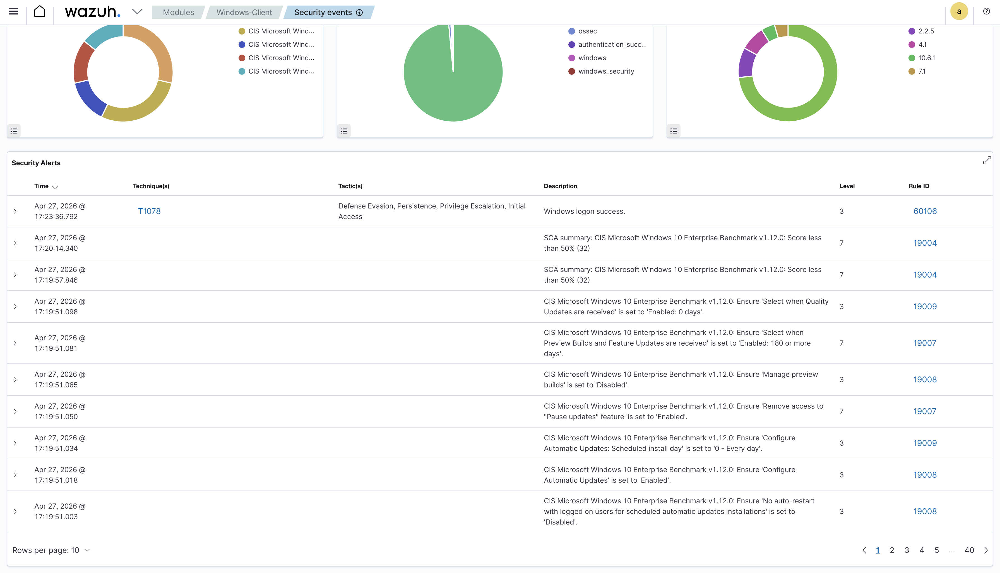

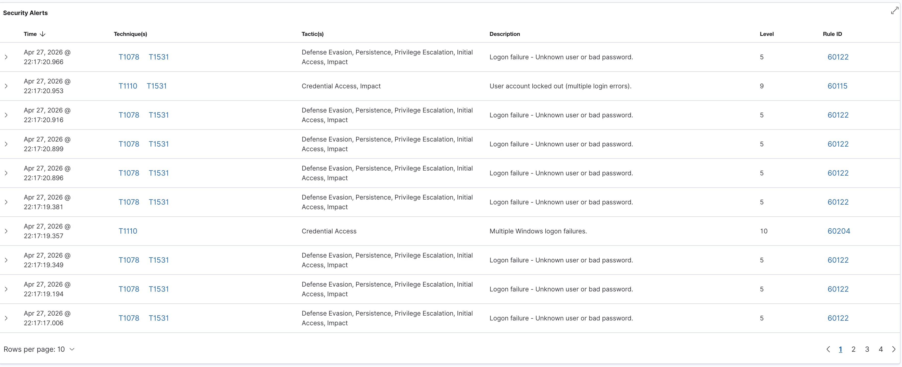

---

### Scenario 2: Unauthorized Local Administrator Account Creation

A local user account was created and added to the local **Administrators** group using PowerShell. This simulated privilege escalation and persistence behavior that may occur after an attacker gains access to a system.

**Security relevance:**  
Unexpected local administrator account creation is a high-value event because it can indicate privilege escalation, persistence, or unauthorized administrative access.

**Evidence:**

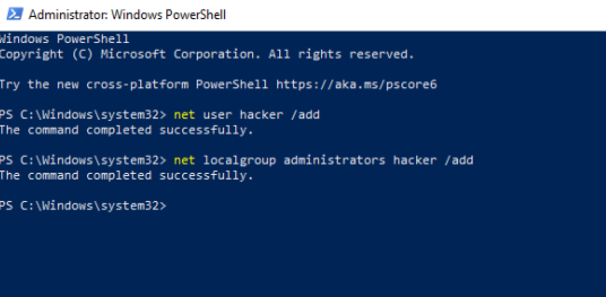

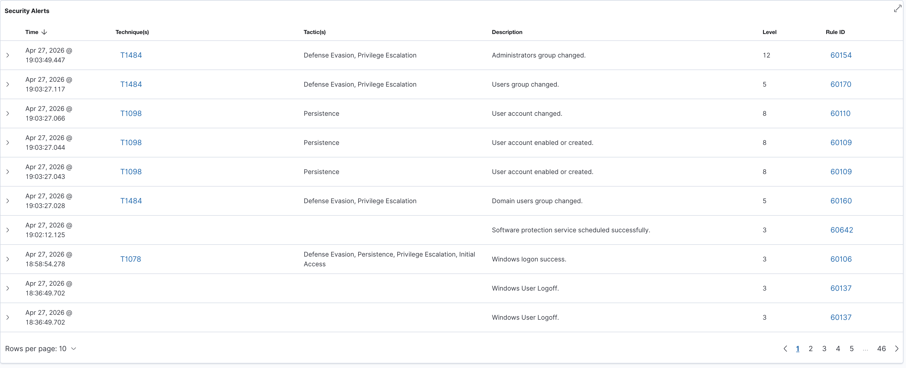

---

## Implementation Steps

### 1. Built the Virtual Lab Environment

Created two virtual machines in Oracle VirtualBox: one Ubuntu VM for the Wazuh server and one Windows VM as the monitored endpoint.

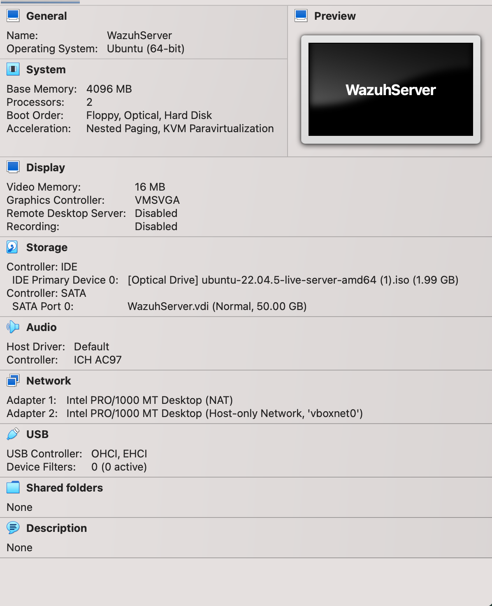

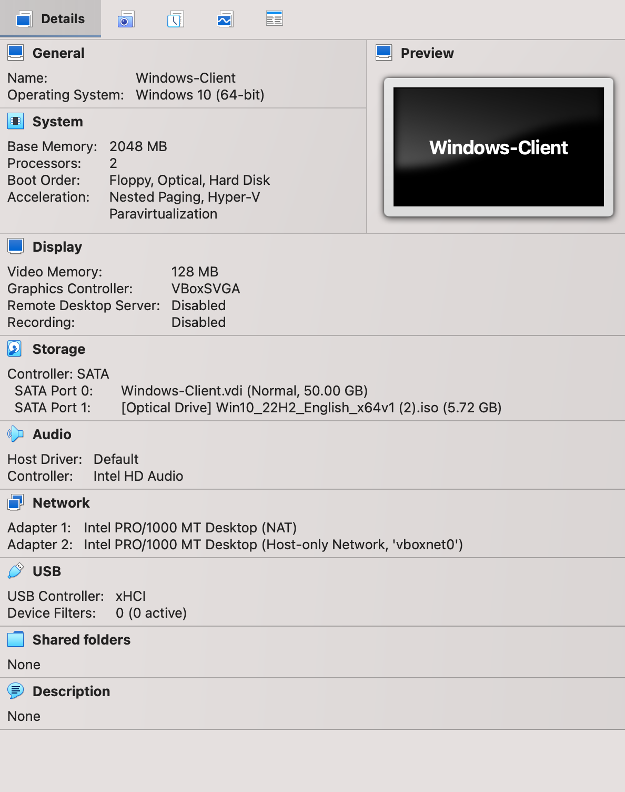

---

### 2. Configured Virtual Networking

Configured a VirtualBox host-only network to allow communication between the Ubuntu Wazuh server and the Windows endpoint.

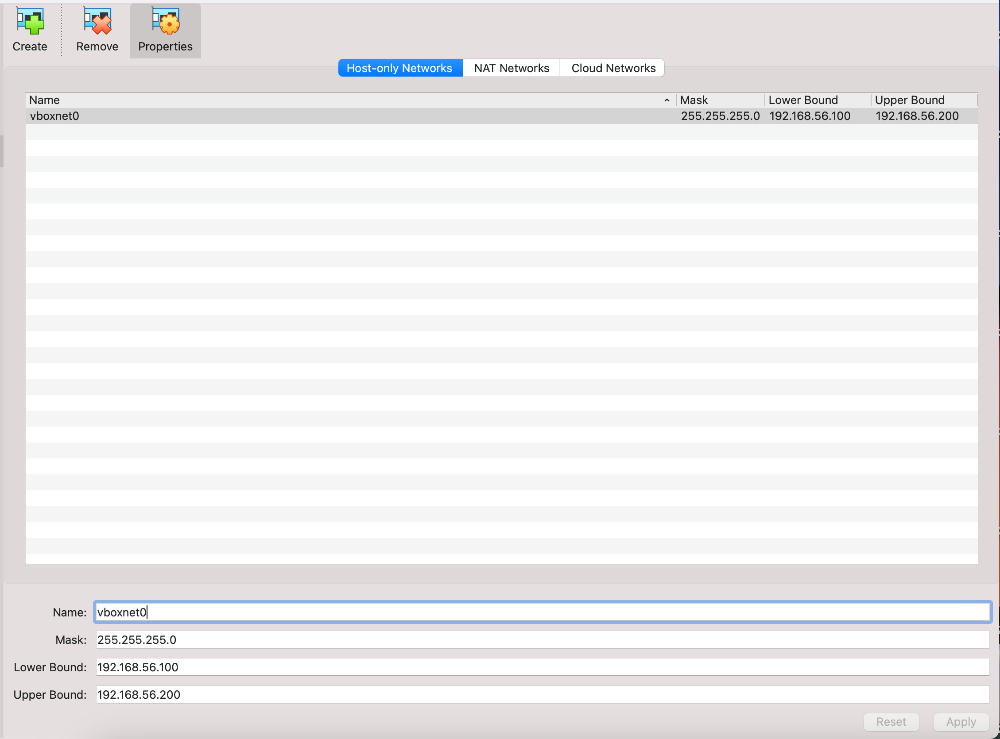

---

### 3. Installed Ubuntu and Deployed Wazuh

Installed Ubuntu on the server VM and deployed Wazuh as the SIEM platform.

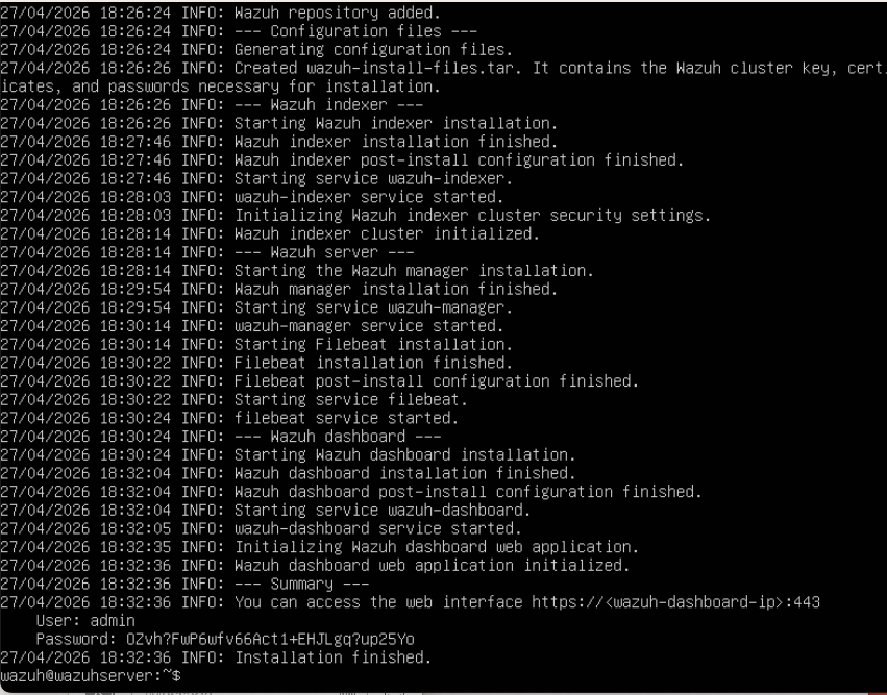

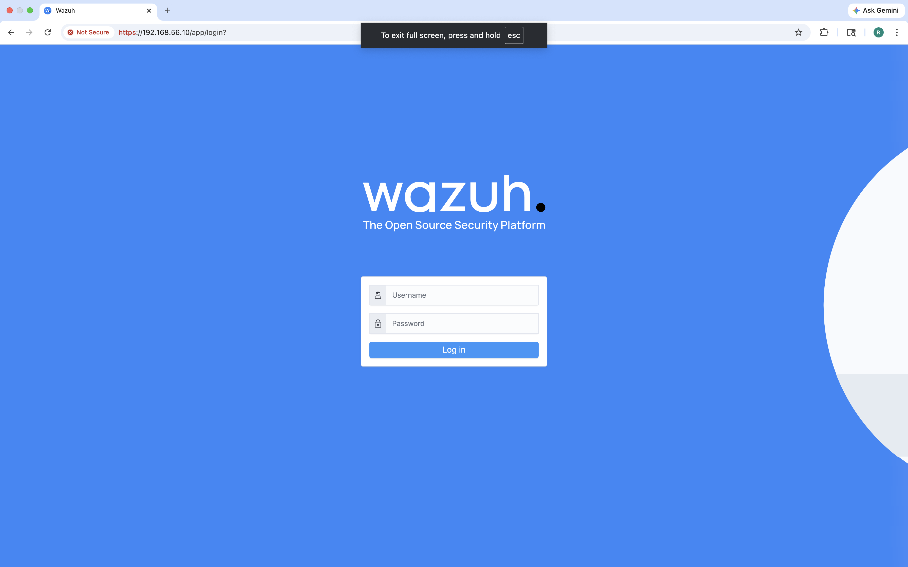

---

### 4. Installed and Verified the Wazuh Agent

Installed the Wazuh agent on the Windows endpoint and confirmed that it successfully connected to the Wazuh server.

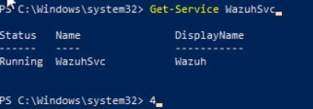

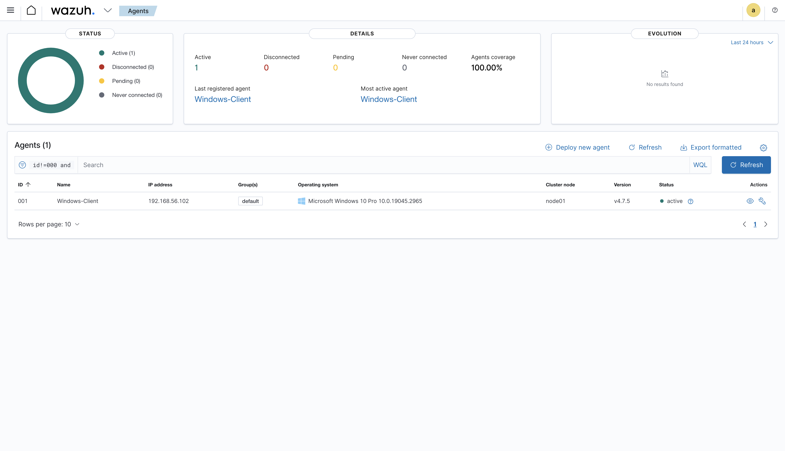

---

### 5. Generated and Reviewed Security Alerts

Simulated suspicious behavior on the Windows endpoint and reviewed the resulting alerts in the Wazuh dashboard.

Activities tested:
- Repeated failed login attempts
- Local user account creation
- Addition of a user to the local Administrators group

---

## Results

The Wazuh server successfully collected and displayed security events from the Windows endpoint. The lab confirmed that Wazuh could detect and surface alerts related to authentication failures and privilege escalation activity.

Key results:
- Windows endpoint successfully onboarded into Wazuh
- Agent status confirmed as active
- Failed login events appeared in the dashboard
- Local administrator account creation activity generated alerts
- Security events were reviewed from a centralized SIEM interface

---

## Skills Demonstrated

- SIEM deployment and configuration
- Endpoint monitoring with Wazuh agents
- Windows security event analysis
- Authentication failure detection
- Privilege escalation detection
- Virtual machine networking
- Linux and Windows administration
- PowerShell-based security testing
- Technical documentation for cybersecurity projects

---
